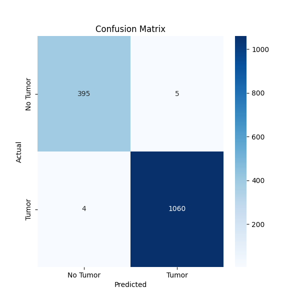
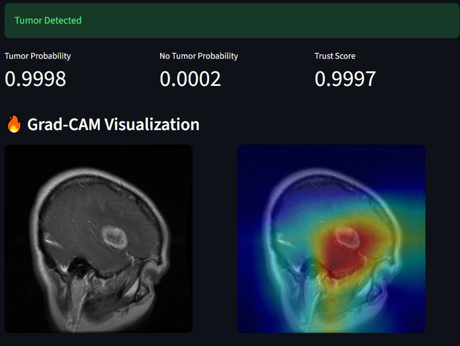
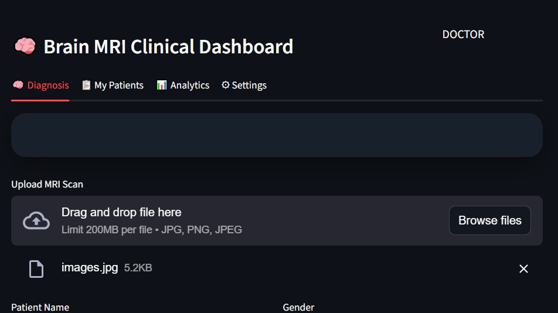
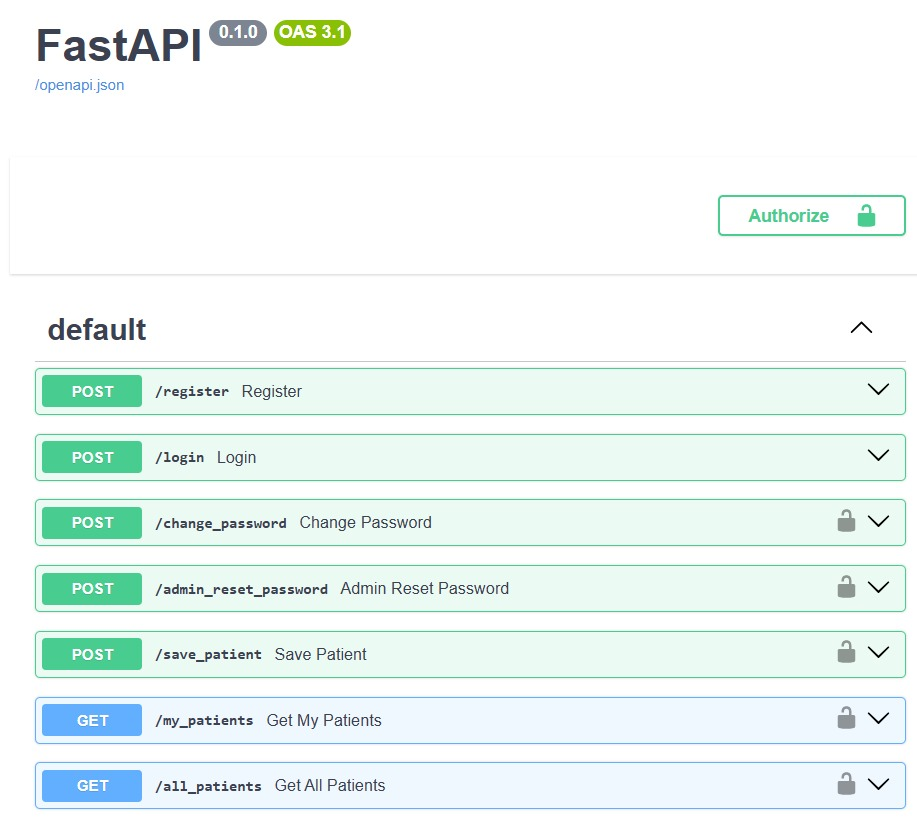

#  AI-Based Brain Tumor Detection with Explainable AI (XAI)

An end-to-end deep learning system for brain tumor detection from MRI scans, enhanced with Explainable AI (Grad-CAM) and clinical trust scoring.

---

##  Project Overview

This project uses a pretrained ResNet model for MRI classification and integrates Grad-CAM to provide visual explanations of model predictions.  

The system includes:
- Deep learning model (Transfer Learning)
- Explainability (Grad-CAM)
- Clinical trust scoring mechanism
- FastAPI backend
- MongoDB logging
- Streamlit hospital-style dashboard

---

##  System Architecture

User → Streamlit UI → FastAPI Backend → TensorFlow Model → Grad-CAM → Trust Score → MongoDB

---

##  Model Performance

- Transfer Learning (ResNet)
- Binary Classification
- Evaluation Metrics:
  - Accuracy
  - Confusion Matrix
  - ROC Curve
  - Training History

###  Confusion Matrix

###  ROC Curve

###  Training History

##  Explainable AI (Grad-CAM)

Grad-CAM highlights important regions in the MRI scan that influenced the prediction.

###  Grad-CAM Output

This increases transparency and clinical trust in AI-assisted diagnosis.

---

##  Streamlit Dashboard

Interactive interface for:
- Uploading MRI images
- Viewing predictions
- Displaying Grad-CAM heatmaps
- Generating clinical reports

###  Application UI

---

## ⚙ FastAPI Backend

REST API built with FastAPI for:
- Model inference
- Data logging
- Clinical report storage

###  API Documentation

---

##  Tech Stack

- Python
- TensorFlow / Keras
- OpenCV
- FastAPI
- MongoDB
- Streamlit
- Grad-CAM
- Scikit-learn

---

##  Security Practices

- Environment variables for secret keys
- `.gitignore` for sensitive files
- Dataset excluded from repository

---

##  Academic Value

- Explainable AI in healthcare
- Trust-aware AI modeling
- End-to-end ML deployment pipeline
- Suitable for final year B.Tech project

---

##  Internship Relevance

This project demonstrates:

- Applied Deep Learning
- Model Evaluation & Validation
- Explainability in AI
- Backend API Development
- Full-stack ML Integration

---

##  Future Improvements

- Multi-class tumor classification
- Uncertainty estimation
- Cloud deployment
- Doctor feedback validation

---

## By:

Anshu Kasula  
B.Tech CSE  (3rd yr)
